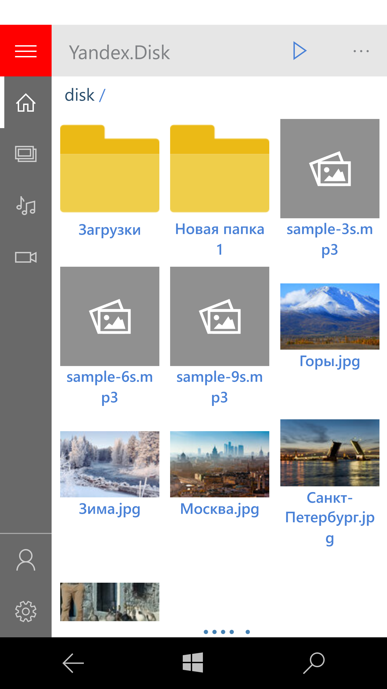
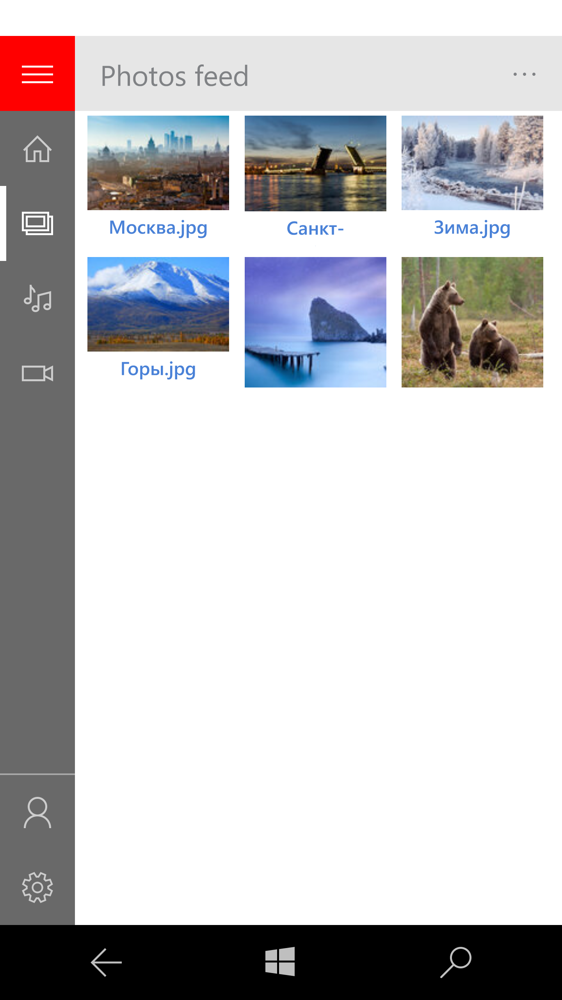
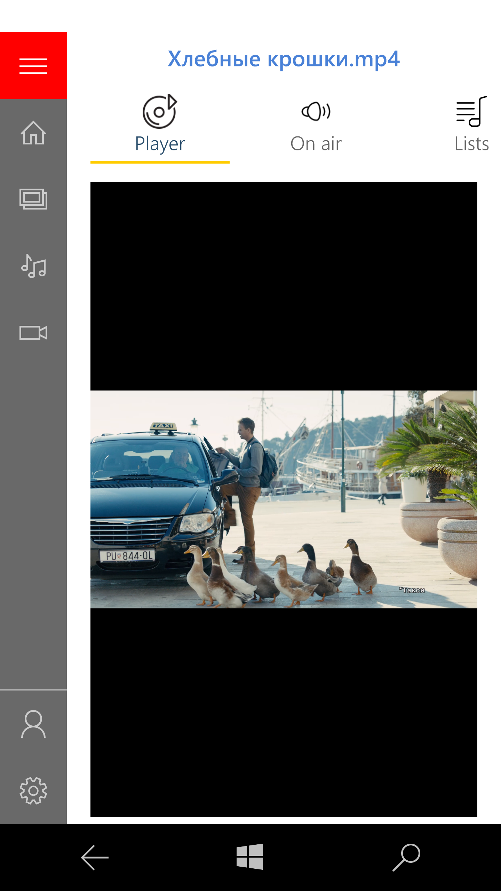

# YaD (Yandex.Disok)
The fork of lost "Ya.D" (Yandex.Disok) project by Dukhnich Vladislav (vd@sys.im)

## What is this
My goal was to port the code on Windows-phone 10 :) 

## About the Ya.D
Ya.D is only UWP app that is currently simplty the *lite* version of Yandex Disk (suppotts only photo/music/video items)

## Screenshots
<table><tr>
<td>  </td>
<td>  </td>
<td>  </td>
</tr></table>

## Supported os-s
- W10
- W10M (min os build: 15063)

No support. RnD only.

-- me 2022